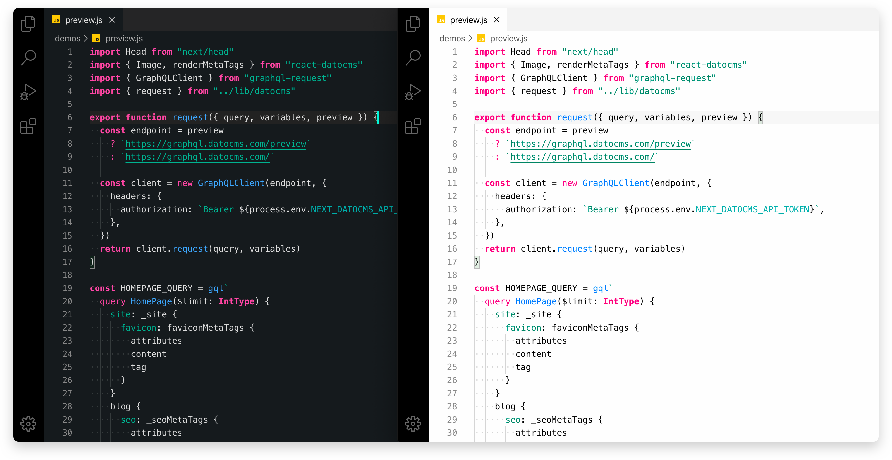
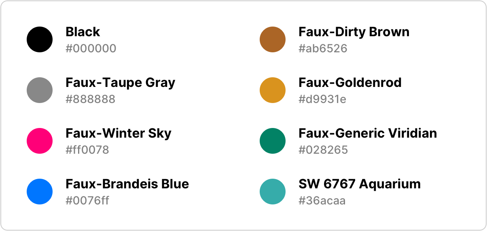
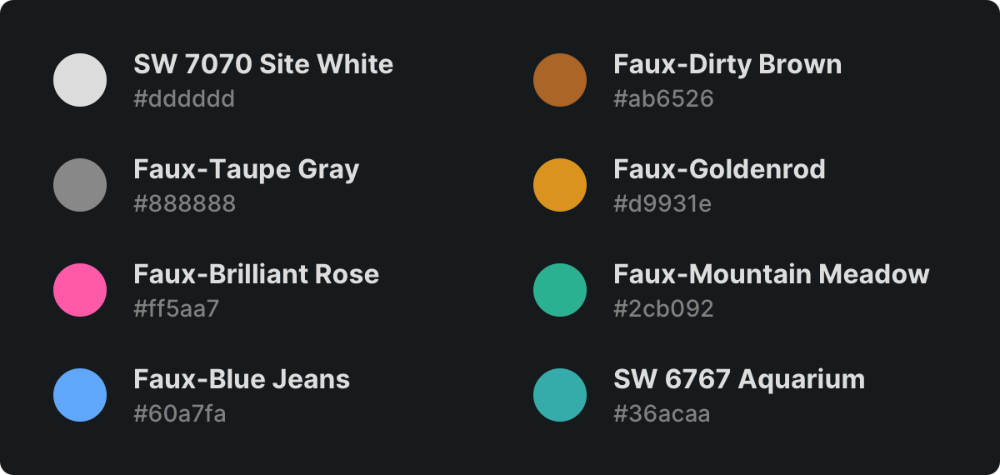

# Nako

**Nako** is an elegant Visual Studio Code theme inspired by Vercel (ZEIT).



## Variants

This color theme comes in two variants:

- **Nako** (dark color theme)
- **Nako Light** (light color theme)

## Palette

### Light

This theme is designed with vibrant and contrast colors, highlighting syntactic constructions and bringing focus to logic flow operators.



### Dark

The dark variant vastly inherits from the light colors, yet with reduced saturation to prevent eye fatigue, while preserving a sharp contrast.




## Recommended settings

This theme works best with the following settings in your VS Code:

```json
{
  "editor.fontFamily": "Menlo",
  "editor.fontSize": 13,
  "editor.fontLigatures": false,
  "workbench.fontAliasing": "antialiased"
}
```
